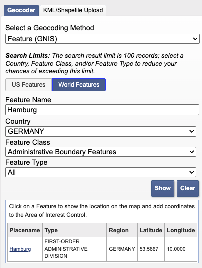
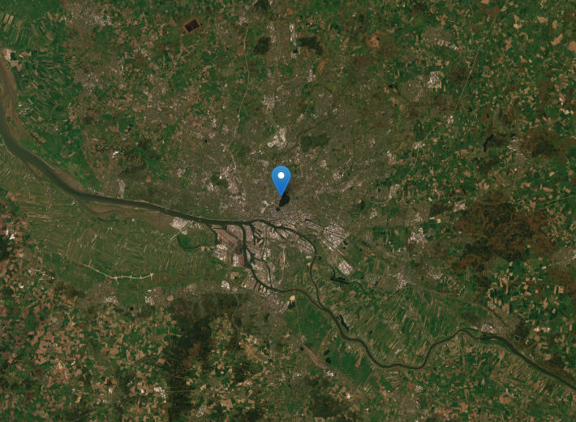
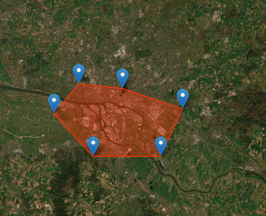
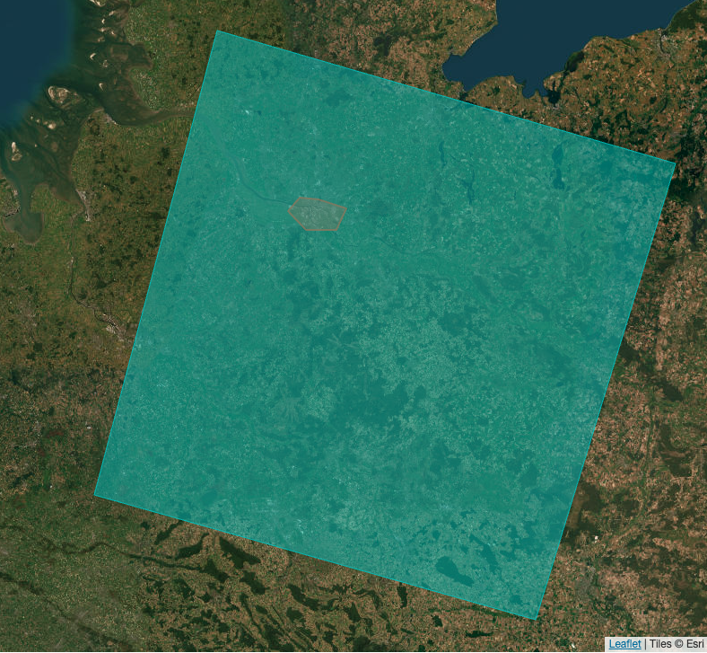
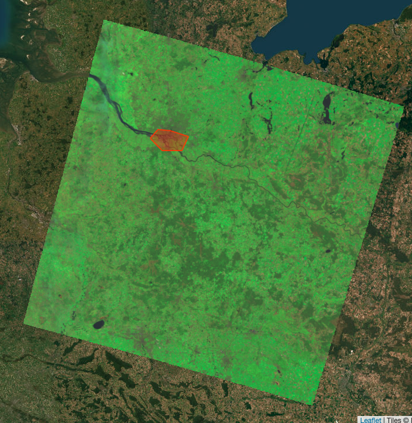

# EarthExplorer Quick Start Guide

This quick-start guide provides an overview for finding and downloading (free) satellite imagery using the USGS [EarthExplorer](https://earthexplorer.usgs.gov/) portal. Anyone can access the portal, although some features are limited to users. The good news: Making an account is free! Just make sure to [properly cite](https://www.usgs.gov/media/images/landsat-product-citation-screenshot) any data you use.

Important note: While you can use EarthExplorer in every browser, the download functionality only works properly in Chrome and Microsoft Edge.

## Finding and selecting region of interest

The first step in finding satellite imagery to work with is locating and annotating your area of interest. Since EarthExplorer doesn't offer labelled base maps outside of the US, this can be a bit tedious. There are two possibilities to quickly zoom to a region: The **Geocoder** function let's you type in a feature name, such as a city or neighborhood name, as well as choose other properties like the country or feature class. Once you select your area from the results, a pin will get added to the map. Then, you can click on the map to add points and further outline your area. You don't need to do this to a high degree of detail, a rough outline of your region is okay.

Alternatively, you can use the **KML/Shapefile Upload** to do exactly that - upload the geometry of a region of interest and automatically select it. You can also manually enter coordinates to zoom to specific points in the **Polygon** section.

## Choosing a date range

There are two ways to filter your results to a specific date range. You can either search for images in between two dates, or you can search for specific months across years. The latter is particularly helpful if you're interested in analysing seasonal data over a period of years. You can also use both filters to, for example, look at images taken in August between 2019 and 2024.

## Dealing with clouds

When using satellite imagery to analyse land surface temperature (LST), clouds can pose a big issue, especially in rainy regions. In EarthExplorer, you can filter your results for cloud cover range from 0% to 100%. In my own experience, filtering cloud coverage to between 20 and 50 percent is a good starting point. The rest comes down to manual inspection of the possible images. This is because the cloud coverage filter refers to an entire satellite image, which is often much larger than the area of interest. As long as there are no clouds above the city, neighborhood, etc. that you're interested in, you're good to go!

## Choosing your data set

For this example, we're working with Landsat Collection 2 Level 2 data. You can find this by first navigating to the **Data Sets** tab, then clicking: Landsat -> Landsat Collection 2 Level 2 -> Landsat 8-9 OLI/TIRS C2 L2.

## Browsing the results

There are two main ways to preview the results of your search. The first is by clicking on the footprint icon to see the extent of an image. This helps you check whether the image captures the entire region of interest.

To the right of the footprint, you can select the browse overlay option, which will let you preview the actual image and check whether your region of interest is free of clouds.

## Additional research

Sometimes, you may only want images from days where the temperature reached a minimum value. For instance, we only analysed imagery from "summer days", which are classified by the German National Weather Service as reaching a minimum of 25C. In such cases, you'll have to do a bit of additional research to decide whether you want to use a given result for your analysis.

## Downloading the images

There are two options for downloading images. You can either directly download single images, or you can bulk download multiple. For both options, you can limit your download to just the relevant data. In our case, that is the surface temperature data in band 10 (`ST_B10.TIF`).
