``` r
library(dplyr) # for manipulating data
library(ggplot2) # for visualization
library(terra) # for working with raster and vector data
```

## Loading and previewing data

Conveniently, the `terra` package in R has great naming conventions for
loading data. It’s also really easy to plot geodata to preview how it
looks. Let’s start with a landsat image.

``` r
landsat = rast('data/LC09_L2SP_196023_20240501_20240502_02_T1_ST_B10.TIF')
plot(landsat)
```

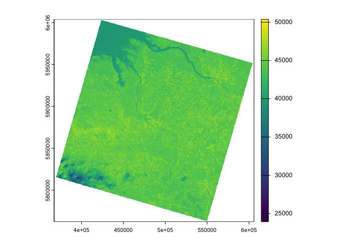

Now we can also load the vector data for Hamburg which contains the
geographical boundaries for each of the city’s districts. We can do this
by directly calling an API endpoint from Hamburg’s (Office for
Geoinformation and
Surveying)\[<https://www.hamburg.de/politik-und-verwaltung/behoerden/behoerde-fuer-stadtentwicklung-und-wohnen/aemter-und-landesbetrieb/landesbetrieb-geoinformation-und-vermessung>\].
In this example, the vector data we’re working with is in GeoJSON
format. However, the `vect` function in `terra` can also handle other
vector data formats, such as Shapefiles.

``` r
hamburg = vect('https://api.hamburg.de/datasets/v1/verwaltungsgrenzen/collections/stadtteile/items?limit=104&f=json')
plot(hamburg)
```

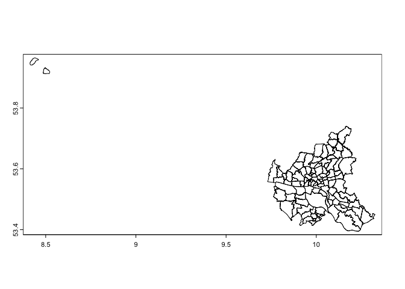

One of the drawbacks of `terra` is that you can’t click on and explore
your dataset from the R environment the same way you could with a normal
data frame or the `sf` package. That being said, you can preview your
data using the standard `head` function, which gives a nice overview of
what data you’re working with.

``` r
hamburg %>%
  head()
```

    ##     bezirk_name bezirk stadtteil_schluessel stadtteil_nummer   stadtteil_name
    ## 1 Hamburg-Mitte      1                02101              101 Hamburg-Altstadt
    ## 2 Hamburg-Mitte      1                02102              102        HafenCity
    ## 3 Hamburg-Mitte      1                02103              103         Neustadt
    ## 4 Hamburg-Mitte      1                02104              104        St. Pauli
    ## 5 Hamburg-Mitte      1                02105              105        St. Georg
    ## 6 Hamburg-Mitte      1                02106              106      Hammerbrook

In our case, we have information on the city district (`bezirk`) and the
neighborhood (`stadtteil`). We can also filter the data, although it
functions a bit differently than with normal dataframes.

Let’s try plot just the neighborhoods in Hamburg’s Altona district.

``` r
altona = subset(hamburg, hamburg$bezirk_name=="Altona")
plot(altona)
```

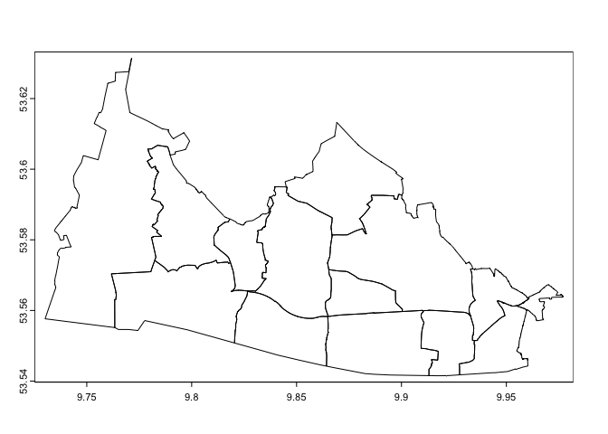

If you want to stick to the classic `tidyr` and `dplyr` syntax, then you
can use the helpful `tidyterra` package. It allows us to interact with
spatial raster or vector data the same way we would with a dataframe.

``` r
library(tidyterra)
```

    ## Warning: package 'tidyterra' was built under R version 4.3.3

    ## 
    ## Attaching package: 'tidyterra'

    ## The following object is masked from 'package:stats':
    ## 
    ##     filter

``` r
# let's filter out the islands of hamburg so we can only focus on the city
hamburg = hamburg %>%
  filter(!(stadtteil_name %in% c("Neuwerk", "Nigehörn", "Scharhörn")))

plot(hamburg)
```

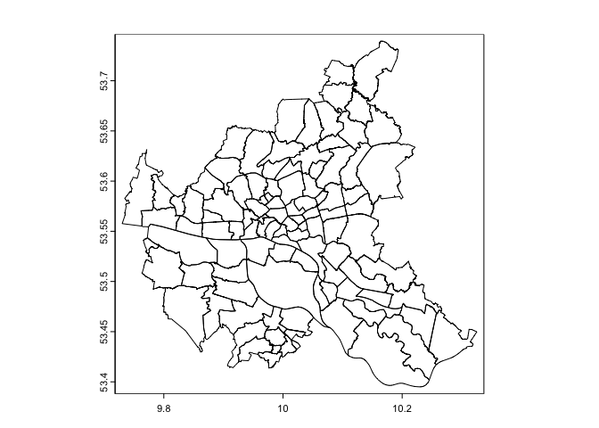

## Dealing with projections

You may have noticed that the x and y axes for our Landsat image and
Hamburg are quite different. That’s because the they are using two
different coordinate systems. It also means that if we tried to plot
both together, it wouldn’t really work out.

In technical terms, that means the data sets have different coordinate
reference systems, also known as CRS. We can check which CRS is being
used quite easily:

``` r
crs(landsat)
```

    ## [1] "PROJCRS[\"WGS 84 / UTM zone 32N\",\n    BASEGEOGCRS[\"WGS 84\",\n        DATUM[\"World Geodetic System 1984\",\n            ELLIPSOID[\"WGS 84\",6378137,298.257223563,\n                LENGTHUNIT[\"metre\",1]]],\n        PRIMEM[\"Greenwich\",0,\n            ANGLEUNIT[\"degree\",0.0174532925199433]],\n        ID[\"EPSG\",4326]],\n    CONVERSION[\"UTM zone 32N\",\n        METHOD[\"Transverse Mercator\",\n            ID[\"EPSG\",9807]],\n        PARAMETER[\"Latitude of natural origin\",0,\n            ANGLEUNIT[\"degree\",0.0174532925199433],\n            ID[\"EPSG\",8801]],\n        PARAMETER[\"Longitude of natural origin\",9,\n            ANGLEUNIT[\"degree\",0.0174532925199433],\n            ID[\"EPSG\",8802]],\n        PARAMETER[\"Scale factor at natural origin\",0.9996,\n            SCALEUNIT[\"unity\",1],\n            ID[\"EPSG\",8805]],\n        PARAMETER[\"False easting\",500000,\n            LENGTHUNIT[\"metre\",1],\n            ID[\"EPSG\",8806]],\n        PARAMETER[\"False northing\",0,\n            LENGTHUNIT[\"metre\",1],\n            ID[\"EPSG\",8807]]],\n    CS[Cartesian,2],\n        AXIS[\"(E)\",east,\n            ORDER[1],\n            LENGTHUNIT[\"metre\",1]],\n        AXIS[\"(N)\",north,\n            ORDER[2],\n            LENGTHUNIT[\"metre\",1]],\n    USAGE[\n        SCOPE[\"Navigation and medium accuracy spatial referencing.\"],\n        AREA[\"Between 6°E and 12°E, northern hemisphere between equator and 84°N, onshore and offshore. Algeria. Austria. Cameroon. Denmark. Equatorial Guinea. France. Gabon. Germany. Italy. Libya. Liechtenstein. Monaco. Netherlands. Niger. Nigeria. Norway. Sao Tome and Principe. Svalbard. Sweden. Switzerland. Tunisia. Vatican City State.\"],\n        BBOX[0,6,84,12]],\n    ID[\"EPSG\",32632]]"

``` r
crs(hamburg)
```

    ## [1] "GEOGCRS[\"WGS 84\",\n    DATUM[\"World Geodetic System 1984\",\n        ELLIPSOID[\"WGS 84\",6378137,298.257223563,\n            LENGTHUNIT[\"metre\",1]]],\n    PRIMEM[\"Greenwich\",0,\n        ANGLEUNIT[\"degree\",0.0174532925199433]],\n    CS[ellipsoidal,2],\n        AXIS[\"geodetic latitude (Lat)\",north,\n            ORDER[1],\n            ANGLEUNIT[\"degree\",0.0174532925199433]],\n        AXIS[\"geodetic longitude (Lon)\",east,\n            ORDER[2],\n            ANGLEUNIT[\"degree\",0.0174532925199433]],\n    ID[\"EPSG\",4326]]"

That returns a bunch of information, not all of which we need. An easier
alternative?

``` r
same.crs(landsat, hamburg)
```

    ## [1] FALSE

Great, a simple no. In order to fix this, we need to reproject either
Hamburg or the Landsat data. In this case, I’ll reproject the data for
Hamburg since it’s not as detailed as the Landsat data and will go a bit
faster.

``` r
new_crs = crs(landsat)

hamburg = hamburg %>%
  project(new_crs)

plot(hamburg)
```

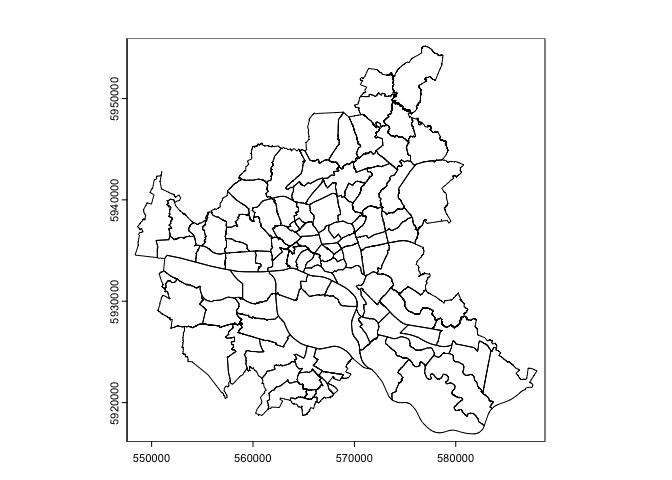

Wonderful, this seems to be a bit closer to what we want. To double
check that everything worked, we can plot the Hamburg districts on top
of the raster data.

``` r
plot(landsat)
plot(hamburg, add=TRUE)
```

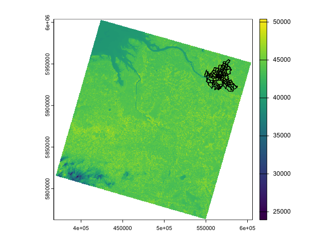

## Cropping and masking

Now, you may have noticed that the Landsat image is, like, way bigger
than we need. We can take two measures to reduce the amount of data
we’re working with, and consequently speed up calculations that we’ll do
later. The first is cropping the image. This is the same thing as
cropping out that random stranger who happened to be in your holiday
vacation photos.

``` r
landsat = crop(landsat, hamburg)
plot(landsat)
plot(hamburg, add=TRUE)
```

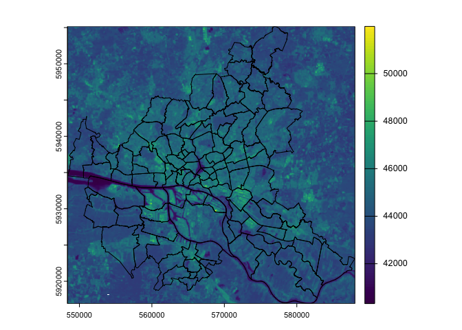

Great, now we’re focused just on the region of Hamburg. But we can also
take it a step further and mask the Landsat image. This basically means
removing parts of the image that are not within our zone of interest.
Think about a PNG file that has a transparent background in parts of it.

``` r
landsat = mask(landsat, hamburg)
plot(landsat)
plot(hamburg, add=TRUE)
```


If you want to speed things up, you can do this in one step by calling
the `crop` function and setting the variable `mask` to true.

## Bands and calculations with raster data

Another thing you may have noticed is that the scale for the Landsat
image doesn’t make sense. We’re working with surface temperature, and
those numbers surely don’t represent anything close to Celsius or
Fahrenheit. That’s because the data is natively in a metric called
digital numbers (DN). Unfortunately, I can’t really tell you what this
means. Fortunately, Landsat provides us with a nice little [scaling
formula](https://www.usgs.gov/landsat-missions/landsat-collection-2-level-2-science-products)
to turn these values into Kelvins: K = (DN \* 0.00341802) + 149.0

The way calculations in raster data work is that, much like mutating an
entire column, each pixel will be put through the given formula. Instead
of columns, however, we have something called bands. Let’s see what
different bands we have.

``` r
varnames(landsat)
```

    ## [1] "LC09_L2SP_196023_20240501_20240502_02_T1_ST_B10"

Alright, let’s make a new band for the same data in Kelvins.

``` r
landsat$lst_kelvin = (landsat$LC09_L2SP_196023_20240501_20240502_02_T1_ST_B10 * 0.00341802) + 149.0
plot(landsat)
```

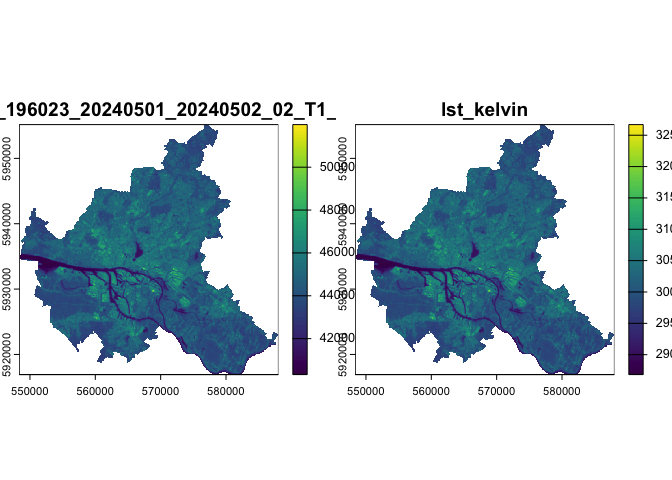

If you want, you could also do it the `tidyr` way.

``` r
landsat %>%
  mutate(tidyr_kelvin = (LC09_L2SP_196023_20240501_20240502_02_T1_ST_B10 * 0.00341802) + 149.0) %>%
  plot(., "tidyr_kelvin")
```

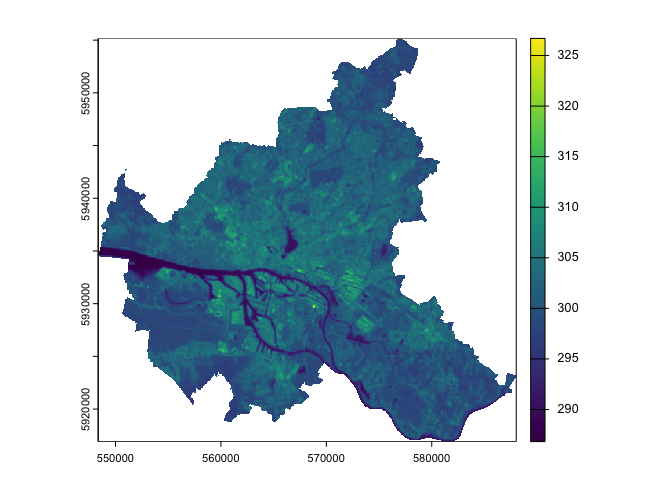

Now we can see that there are two columns, one of which is closer to
what we want. Let’s go ahead and convert the data in Kelvins to Celsius.

``` r
landsat$lst_celsius = landsat$lst_kelvin - 273.15
plot(landsat, "lst_celsius")
plot(hamburg, add=TRUE, border='white')
```

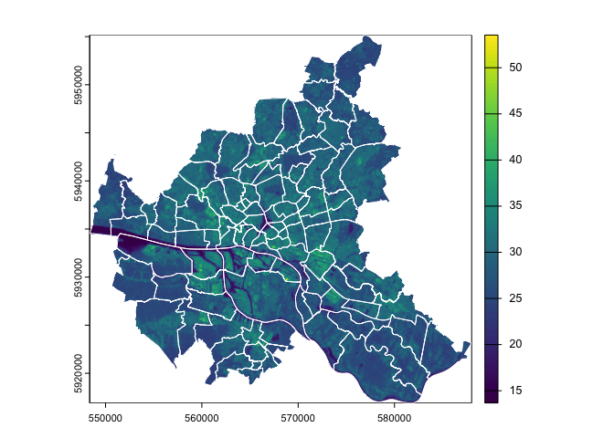

## Zonal statistics

### Means

Now that we have our data in Celsius, let’s try to answer our original
question: What was the average surface temperature in each of Hamburg’s
neighborhoods on TK date at X time? And which of these neighborhoods in
the most affected by head? We can actually calculate that super easily
using the `extract` function.

``` r
extract(landsat$lst_celsius, hamburg, fun=mean)
```

    ##      ID lst_celsius
    ## 1     1    31.36533
    ## 2     2    26.23296
    ## 3     3    29.66570
    ## 4     4    31.22899
    ## 5     5    29.42589
    ## 6     6    32.84807
    ## 7     7    31.60889
    ## 8     8    30.71177
    ## 9     9    30.48211
    ## 10   10    28.87342
    ## 11   11    33.59000
    ## 12   12    27.44059
    ## 13   13    29.13561
    ## 14   14    27.68766
    ## 15   15    28.14870
    ## 16   16    26.87640
    ## 17   17    28.04768
    ## 18   18    24.14075
    ## 19   19    29.55467
    ## 20   20    32.80345
    ## 21   21    32.83813
    ## 22   22    30.11713
    ## 23   23    30.47630
    ## 24   24    29.26081
    ## 25   25    26.25222
    ## 26   26    30.54817
    ## 27   27    29.07601
    ## 28   28    25.16295
    ## 29   29    24.45327
    ## 30   30    29.45266
    ## 31   31    26.36762
    ## 32   32    25.16744
    ## 33   33    31.88818
    ## 34   34    28.30195
    ## 35   35    29.27064
    ## 36   36    32.30360
    ## 37   37    30.16544
    ## 38   38    28.93216
    ## 39   39    29.31239
    ## 40   40    29.73895
    ## 41   41    31.27791
    ## 42   42    31.92539
    ## 43   43    30.90110
    ## 44   44    30.10392
    ## 45   45    29.15799
    ## 46   46    28.86106
    ## 47   47    27.99451
    ## 48   48    30.29569
    ## 49   49    31.16249
    ## 50   50    30.74581
    ## 51   51    30.64780
    ## 52   52    26.97530
    ## 53   53    30.35900
    ## 54   54    28.92753
    ## 55   55    31.44443
    ## 56   56    31.47947
    ## 57   57    29.58029
    ## 58   58    29.89311
    ## 59   59    30.43308
    ## 60   60    28.90451
    ## 61   61    29.75861
    ## 62   62    29.65444
    ## 63   63    28.20286
    ## 64   64    28.90879
    ## 65   65    28.83342
    ## 66   66    27.70648
    ## 67   67    26.99774
    ## 68   68    26.97679
    ## 69   69    25.49888
    ## 70   70    26.98756
    ## 71   71    27.14983
    ## 72   72    28.61423
    ## 73   73    29.10122
    ## 74   74    30.00099
    ## 75   75    26.63753
    ## 76   76    25.59862
    ## 77   77    26.33047
    ## 78   78    25.95953
    ## 79   79    26.23606
    ## 80   80    25.61534
    ## 81   81    27.73699
    ## 82   82    27.60804
    ## 83   83    27.97530
    ## 84   84    25.85449
    ## 85   85    25.69762
    ## 86   86    28.72302
    ## 87   87    31.11758
    ## 88   88    25.76337
    ## 89   89    25.30754
    ## 90   90    29.02862
    ## 91   91    27.99208
    ## 92   92    28.70037
    ## 93   93    26.97316
    ## 94   94    27.15383
    ## 95   95    27.01155
    ## 96   96    26.97852
    ## 97   97    27.44690
    ## 98   98    30.65282
    ## 99   99    27.60931
    ## 100 100    27.13376
    ## 101 101    25.43123
    ## 102 102    25.75728
    ## 103 103    25.67910

The results show us the average temperature for each district.
Annoyingly, we don’t get the name of the district, but everything aligns
based on the row number. In order to save this data as a new variable in
our vector file, we need to return the responses without the ID column.

``` r
hamburg$mean_lst = extract(landsat$lst_celsius, hamburg, fun=mean, ID=FALSE)
plot(hamburg, "mean_lst")
```

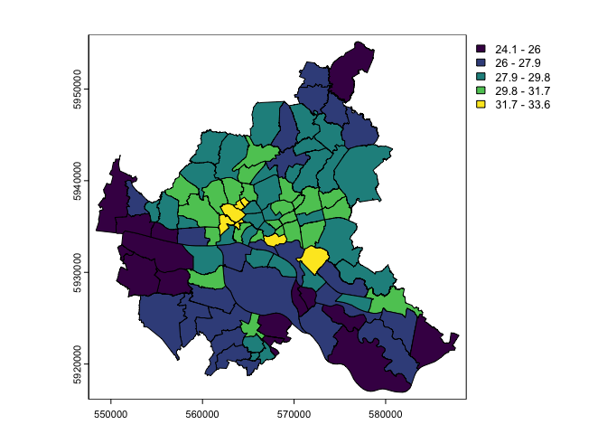

That was easy! We can also adjust some settings while plotting so that
we have a continuous color scale and a better palette.

``` r
plot(hamburg, "mean_lst", type="continuous", col=hcl.colors("Reds", n=100, rev=TRUE))
```

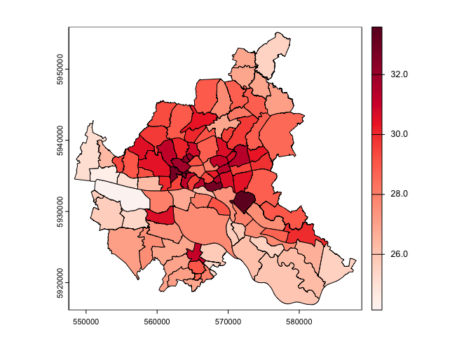

### Weighted means

Something to keep in mind when working with raster data is how each
pixel is handled. Our data has a resolution of 30m, which isn’t huge,
but also not super detailed. That likely means there are a few pixels
that land on the border between districts. Let’s take a look at this
with the neighborhood Sternschanze in Altona.

``` r
# since we filtered data before reprojecting
sternschanze = hamburg %>%
  filter(stadtteil_name=="Sternschanze")

landsat %>%
  crop(., sternschanze, mask=TRUE) %>%
  plot("lst_celsius")

plot(sternschanze, add=TRUE, border="white")
```

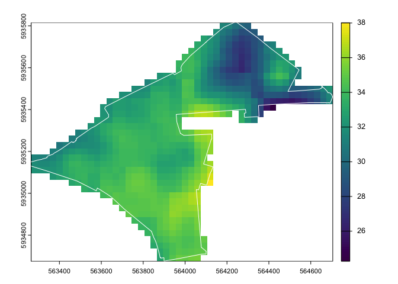

We can see that there are a lot of pixels that *touch* the border of
Sternschanze, but are also partially outside. When calling the `extract`
function, the default functionality is to assign the pixel to whichever
geometry its center point falls in. When the pixel resolution is
relatively high compared to the area of geometries, then this will not
have a huge effect on your results. But for smaller areas, it could skew
them.

In order to understand this better, let’s first calculate the weighted
mean - which only considers the approximate portion of a pixel that
falls within a geometry.

``` r
hamburg$weighted_mean_lst = extract(landsat$lst_celsius, hamburg, fun=mean, weights=TRUE, ID=FALSE)
plot(hamburg, "weighted_mean_lst", type="continuous", col=hcl.colors("Reds", n=100, rev=TRUE))
```


It doesn’t look so different from our first chart, so let’s take a look
at the difference between values.

``` r
hamburg$lst_weighted_diff = hamburg$mean_lst - hamburg$weighted_mean_lst

hamburg %>%
  ggplot(., aes(lst_weighted_diff)) +
  geom_histogram()
```

    ## `stat_bin()` using `bins = 30`. Pick better value with `binwidth`.

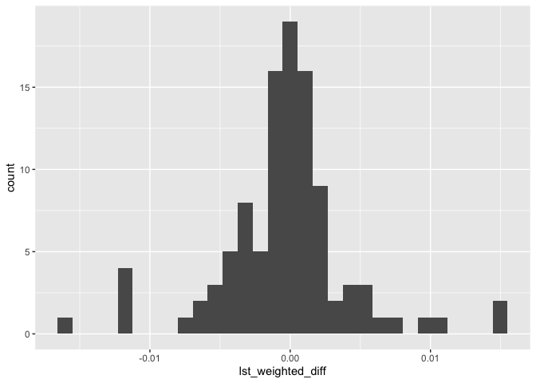

Pretty standard distribution and the difference in values is not so
huge. That being said, not each neighborhood is affected equally. Let’s
compare the difference in values to the area of the distrct. We can use
that with the `expanse` function.

``` r
hamburg$area_km = expanse(hamburg, unit="km")

hamburg %>%
  ggplot(., aes(area_km, lst_weighted_diff)) +
  geom_point()
```

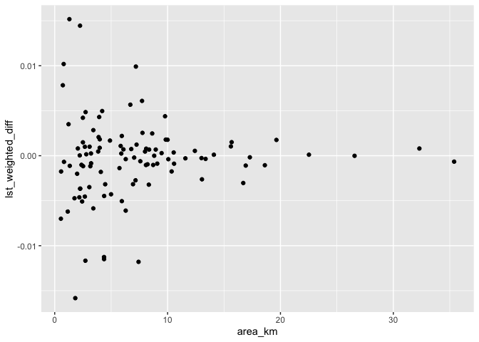

Now it’s very easy to see that the calculations for mean surface
temperature in smaller districts are much more impacted by whether or
not we use the weighted mean. So let’s use the weighted mean for our
final calculation.

## Global statistics

Something worth noting is that we’re not necessarily interested in the
temperature of each district, but how they compare to each other. What
we want is the *relative* temperature. In order to do that, we need to
calculate the mean temperature for all of Hamburg.

But we can’t just calculate the mean of the neighborhood means. Some
neighborhoods are way larger than others, which would disproportionately
affect our calculation. So, to calculate the mean value for all of
hamburg, we can call the `global` function.

``` r
global(landsat, fun=mean, na.rm=TRUE) # without na.rm=TRUE, we'll get an error, since the pixels that have been masked out have a value of NA
```

    ##                                                        mean
    ## LC09_L2SP_196023_20240501_20240502_02_T1_ST_B10 44472.18652
    ## lst_kelvin                                        301.00682
    ## lst_celsius                                        27.85682

In order to calculate relative mean temperature, we then just subtract
the global mean from the neighborhood means (weighted, of course).

``` r
global_mean_lst = global(landsat$lst_celsius, fun=mean, na.rm=TRUE)$mean

hamburg$weighted_relative_lst = hamburg$weighted_mean_lst - global_mean_lst

plot(hamburg, "weighted_relative_lst", type="continuous", col=hcl.colors("RdYlBu", n=100, rev=TRUE))
```

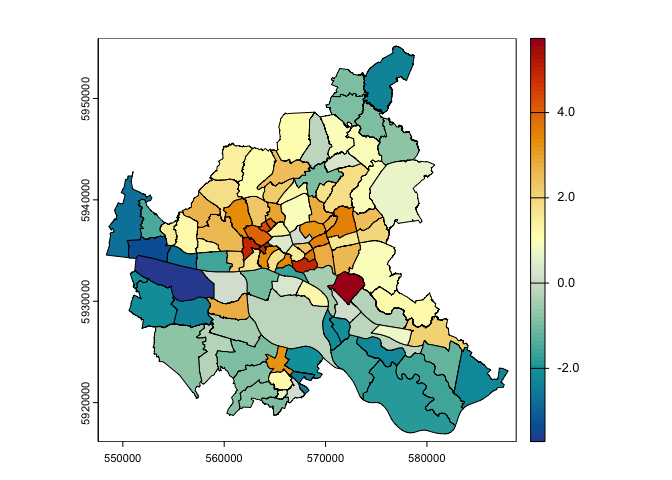

Amazing! Beautiful! Now we can easily see which neighborhoods in Hamburg
were hotter on TK date than others. We can also pull up the names.

``` r
hamburg %>%
  arrange(-weighted_relative_lst) %>%
  select(bezirk_name, stadtteil_name, weighted_mean_lst, weighted_relative_lst) %>%
  head(10)
```

    ##      bezirk_name stadtteil_name weighted_mean_lst weighted_relative_lst
    ## 1  Hamburg-Mitte      Billbrook          33.59611              5.739283
    ## 2  Hamburg-Mitte    Hammerbrook          32.84386              4.987035
    ## 3         Altona    Altona-Nord          32.83810              4.981279
    ## 4         Altona   Sternschanze          32.81045              4.953629
    ## 5     Eimsbüttel  Hoheluft-West          32.29576              4.438941
    ## 6   Hamburg-Nord   Hoheluft-Ost          31.92714              4.070318
    ## 7     Eimsbüttel     Eimsbüttel          31.88902              4.032195
    ## 8  Hamburg-Mitte      Borgfelde          31.60957              3.752747
    ## 9       Wandsbek       Wandsbek          31.47727              3.620450
    ## 10      Wandsbek         Eilbek          31.44916              3.592333

Wow, the neighborhood Billbrook was nearly 6 degrees Celsius hotter than
Hamburg on average. At least, at the time this image was taken. In order
to look at trends over time, we need to extend our workflow a little
bit.

## Build a pipeline

The best way to standardize a workflow is by writing some functions. So
I’ve gone ahead and written a function that will do exactly what we just
did with one line of code. The only input is the file path.

``` r
get_relative_lst = function(fpath, vector) {

  # load files
  raster = rast(fpath)

  # reproject if necessary
  if (!same.crs(raster, vector)) {
    new_crs = crs(raster)
    vector = project(vector, new_crs)
  }

  # crop and mask
  raster = crop(raster, vector, mask=TRUE)

  # convert from DN to celsius (or whatever other calculation you might need to do)
  raster = (raster * 0.00341802) + 149.0 - 273.15

  # calculate zonal statistics
  mean_lst = extract(raster, vector, fun=mean, ID=FALSE)

  # calculate global statistics
  global_mean = global(raster, fun=mean, na.rm=TRUE)$mean

  # calculate relative values
  relative_lst = mean_lst - global_mean

  # and return
  return(relative_lst)
}
```

To save some hard coding each file name, we can get a list of all the
files we want in a directory. We can even pay attention to the file
extension using regex!

``` r
# generate list of all images

landsat_list = list.files('data', pattern=".TIF", full.names = TRUE)
landsat_list
```

    ## [1] "data/LC08_L2SP_195023_20240502_20240511_02_T1_ST_B10.TIF"
    ## [2] "data/LC09_L2SP_196023_20240501_20240502_02_T1_ST_B10.TIF"

Then we can apply our function to each of the file paths in this list.

``` r
relative_lst_list = lapply(landsat_list, get_relative_lst, vector=hamburg)
```

Since this returns a list of data frames, we can merge all the columns
together to make it a bit easier to work with.

``` r
relative_lst_df = do.call(cbind, relative_lst_list)

relative_lst_df %>%
  head()
```

    ##   LC08_L2SP_195023_20240502_20240511_02_T1_ST_B10
    ## 1                                        3.579324
    ## 2                                       -1.114901
    ## 3                                        1.863404
    ## 4                                        3.032370
    ## 5                                        1.761437
    ## 6                                        4.822183
    ##   LC09_L2SP_196023_20240501_20240502_02_T1_ST_B10
    ## 1                                        3.508504
    ## 2                                       -1.623860
    ## 3                                        1.808875
    ## 4                                        3.372165
    ## 5                                        1.569066
    ## 6                                        4.991251

You’ll notice that each column is the name of the file where it came
from. Pretty convenient! Now the only thing left to do is calculate the
mean across each image and add the resulting values to our vector data.

``` r
hamburg$mean_relative_lst = rowMeans(relative_lst_df)

plot(hamburg, "mean_relative_lst", type="continuous", col=hcl.colors("RdYlBu", n=100, rev=TRUE))
```

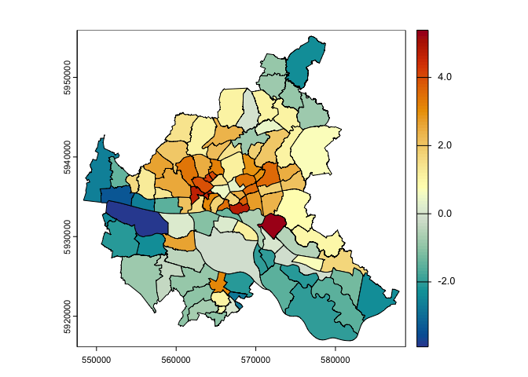
